# Roadmap

## Complete Backend Development

### Fundamental: Basics

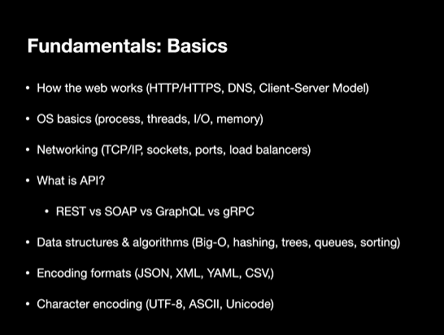

### Backend Programming Language

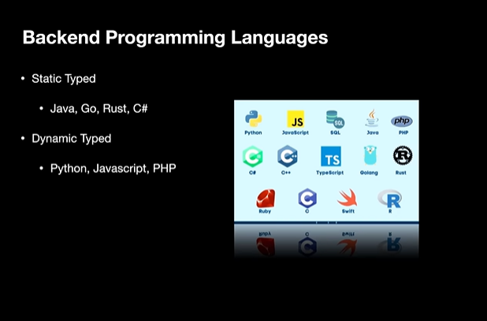

### Version Control & Collaboration

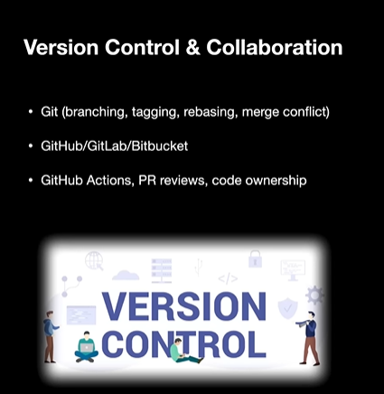

### Package Managers & Build Tools

### Databases (SQL + NoSQL)

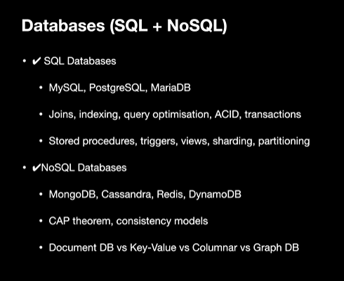

### Backend Frameworks (Pick based on language)

.png)

### API Design & Standards

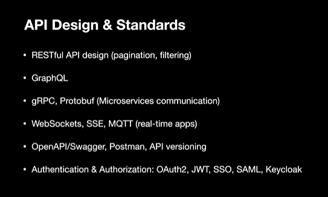

### Caching & Performance

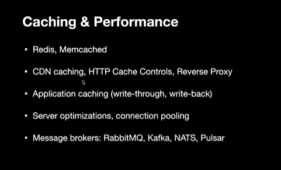

### Microservice & Distributed Systems

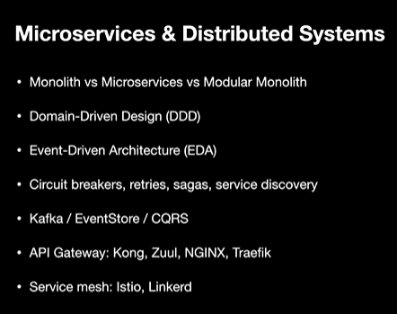

### Cloud & DevOps

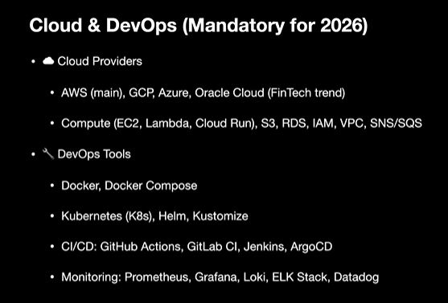

### Security

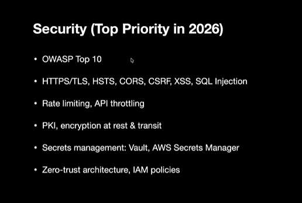

### Testing & Quality Engineering

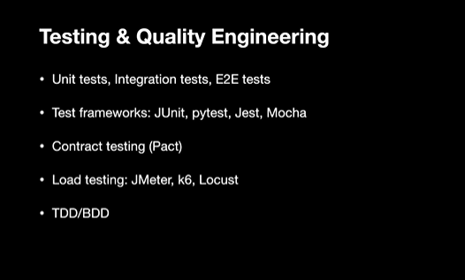

### Observability & Logging

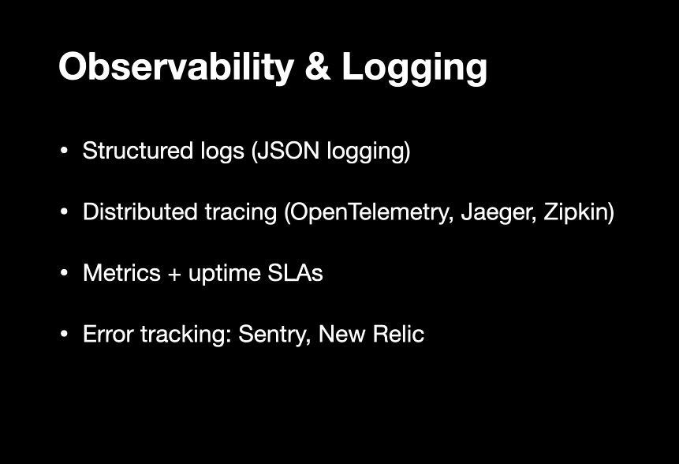

### Scaling & High-Availability Architecture

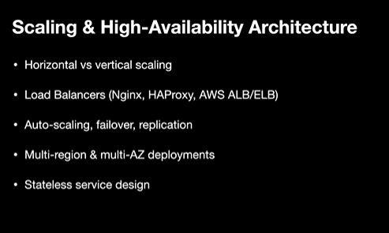

### Serverless && Edge Computing

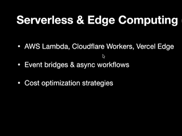

### AI-Assisted Backend

### Learning path order for beginners (Step-by-Step)

.png)